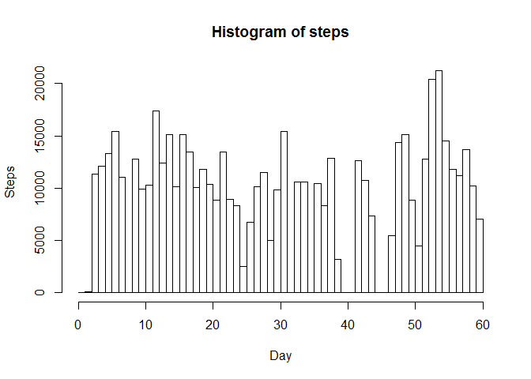
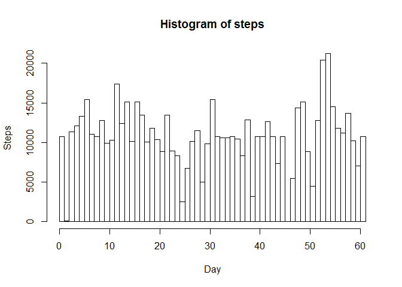
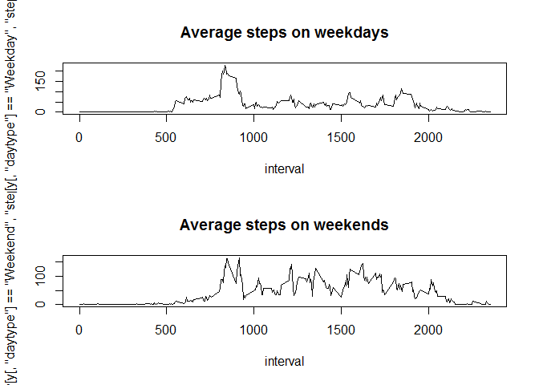

# Reproducible Research: Peer Assessment 1


## Loading and preprocessing the data


```r
x <- read.csv("activity.csv")
```

## What is mean total number of steps taken per day?


```r
stepsPerDay <- tapply(x$steps, x$date, sum, na.rm=TRUE)

meanStepsPerDay <-  mean(stepsPerDay, na.rm = TRUE)
meanStepsPerDay
```

```
## [1] 9354.23
```

```r
medianStepsPerDay <- median(stepsPerDay, na.rm = TRUE)
medianStepsPerDay
```

```
## [1] 10395
```

```r
steps = 0

for (i in 1:length(stepsPerDay)){
  steps <- c(steps, rep(i, stepsPerDay[i]))
  
}

hist( steps, xlab="Day", ylab="Steps", breaks=length(stepsPerDay))
```

<!-- -->

## What is the average daily activity pattern?


```r
intervalAvg <-  tapply(x$steps, x$interval, mean, na.rm=TRUE)

interval <- x[1:288, "interval"]

plot(x=interval, y=intervalAvg, type="l", xlab="Interval", ylab="Steps")
```

<!-- -->

```r
maxIntervali <- which.max(intervalAvg)
maxInterval <- intervalAvg[maxIntervali]
maxInterval
```

```
##      835 
## 206.1698
```

## Imputing missing values


```r
sumMissingValues <- sum( is.na(x[, "steps"]) == 1)
sumMissingValues
```

```
## [1] 2304
```

```r
xnew <- x

for (i in 1:length(x$steps)){
  
  if ( is.na(x[i, "steps"]) ){
    xnew[i, "steps"] <- intervalAvg [which(names(intervalAvg) == x[i, "interval"])]
  }
}


stepsPerDayN <- tapply(xnew$steps, xnew$date, sum, na.rm=TRUE)

meanStepsPerDayN <-  mean(stepsPerDayN, na.rm = TRUE)
meanStepsPerDayN
```

```
## [1] 10766.19
```

```r
medianStepsPerDayN <- median(stepsPerDayN, na.rm = TRUE)
medianStepsPerDayN
```

```
## [1] 10766.19
```

```r
steps = 0

for (i in 1:length(stepsPerDayN)){
  steps <- c(steps, rep(i, stepsPerDayN[i]))
}

hist( steps, xlab="Day", ylab="Steps", breaks=length(stepsPerDayN))
```

<!-- -->

```r
### Imputing NA values with average step for same interval significantly raised daily steps per day where the day 
### had NA values
```

## Are there differences in activity patterns between weekdays and weekends?


```r
xnew$weekday <- weekdays( as.Date (xnew[, "date"]))

xnew$daytype <- factor( ifelse (xnew[, "weekday"] == "Saturday" |  xnew[, "weekday"] == "Sunday", "Weekend", "Weekday") )

y <- aggregate(steps~daytype+interval, xnew, mean)

par(mfcol=c(2,1))

plot(interval, y[ y[, "daytype"] == "Weekday", "steps"], main="Average steps on weekdays", type="l")
plot(interval, y[ y[, "daytype"] == "Weekend", "steps"], main="Average steps on weekends", type="l")
```

<!-- -->
